# Azure Enterprise Multi-Tier Infrastructure as Code

## Overview

This project demonstrates the deployment of a production-inspired multi-tier application environment on Microsoft Azure using Terraform. The infrastructure was built entirely as Infrastructure as Code (IaC) to automate provisioning, improve deployment consistency, and showcase enterprise cloud engineering practices.

The environment includes secure networking, application delivery through Azure Application Gateway, a Linux application server running NGINX, and an Azure SQL Database protected by a Private Endpoint. The deployment emphasizes automation, security, scalability, and repeatable cloud infrastructure.

---

## Business Scenario

An organization is migrating an internal Human Resources (HR) application to Microsoft Azure. The goal is to provide a secure, scalable, and highly available environment while minimizing manual infrastructure provisioning.

To accomplish this, Terraform provisions the complete cloud environment, enabling infrastructure to be version controlled, repeatable, and easily maintained.

---

## Solution Architecture

The solution consists of:

- Azure Resource Group
- Azure Virtual Network (VNet)
- Dedicated Application Gateway Subnet
- Dedicated Application Subnet
- Dedicated Data Subnet
- Network Security Groups (NSGs)
- Azure Application Gateway
- Ubuntu Linux Virtual Machine
- NGINX Web Server
- Azure SQL Server
- Azure SQL Database
- Azure Private Endpoint
- Public IP Addresses
- Network Interface

---

## Architecture Flow

```
Internet
      │
      ▼
Azure Application Gateway
      │
      ▼
Ubuntu Linux VM
(NGINX Web Server)
      │
      ▼
Azure SQL Database
      │
Private Endpoint
```

---

## Technologies Used

| Category | Technologies |
|----------|--------------|
| Cloud | Microsoft Azure |
| Infrastructure as Code | Terraform |
| Compute | Azure Virtual Machine |
| Networking | Virtual Network, Subnets, NSGs, Public IP |
| Load Balancing | Azure Application Gateway |
| Database | Azure SQL Database |
| Security | Private Endpoint |
| Operating System | Ubuntu Linux |
| Web Server | NGINX |

---

## Key Features

- Infrastructure fully deployed using Terraform
- Secure virtual network segmentation
- Automated Linux VM provisioning
- NGINX installed using cloud-init
- Layer 7 application routing with Azure Application Gateway
- Azure SQL Database deployment
- Secure database communication using Azure Private Endpoint
- Infrastructure lifecycle managed through Terraform

---

## Business Value

This project demonstrates how Infrastructure as Code enables organizations to standardize cloud deployments, reduce manual configuration, and improve operational efficiency. Network segmentation, secure database connectivity, and automated provisioning help create a scalable and maintainable cloud environment while supporting enterprise security best practices.

---

## Skills Demonstrated

- Microsoft Azure
- Terraform
- Infrastructure as Code
- Azure Networking
- Virtual Networks
- Network Security Groups
- Azure Application Gateway
- Azure SQL Database
- Private Endpoint
- Linux Administration
- NGINX
- Cloud Security
- Cloud Architecture
- Infrastructure Automation

---

## Deployment

Initialize Terraform

```bash
terraform init
```

Validate the configuration

```bash
terraform validate
```

Review the deployment plan

```bash
terraform plan
```

Deploy the infrastructure

```bash
terraform apply
```

Destroy the infrastructure

```bash
terraform destroy
```

---

## Repository Structure

```
azure-enterprise-multier-iac/
│
├── provider.tf
├── variables.tf
├── terraform.tfvars
├── main.tf
├── outputs.tf
├── README.md
│
├── diagrams/
├── screenshots/
└── docs/
```

---

## Screenshots

### Terraform Deployment

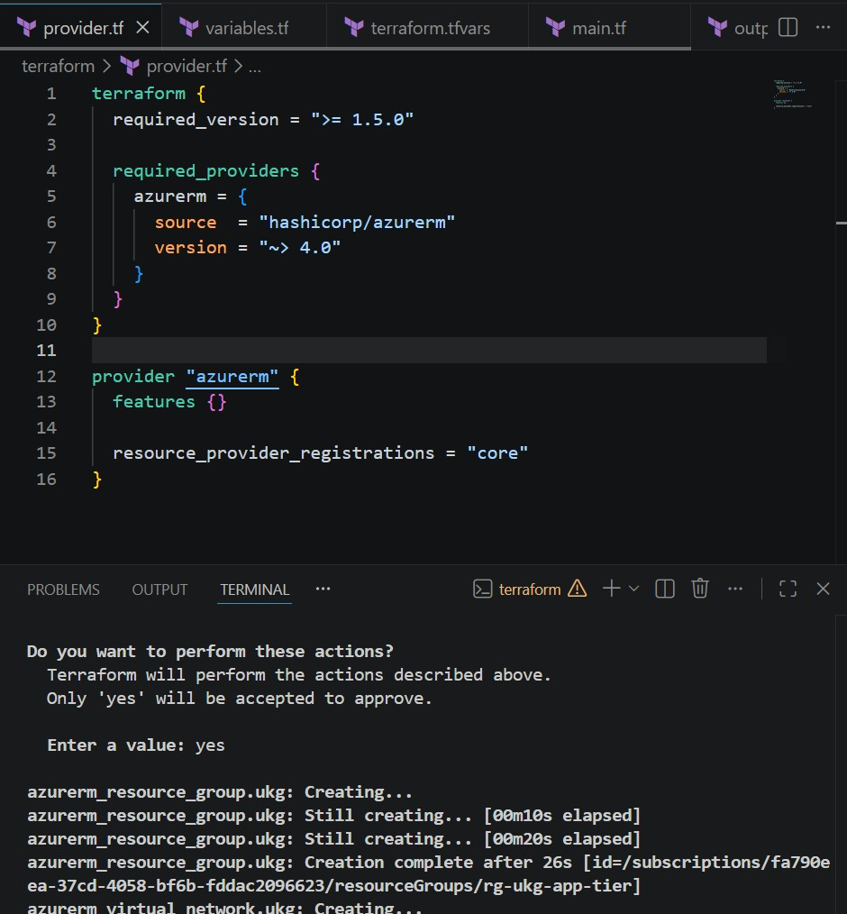

### Application Gateway

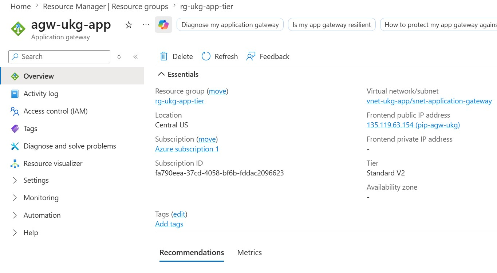

### Enterprise HR SaaS Platform

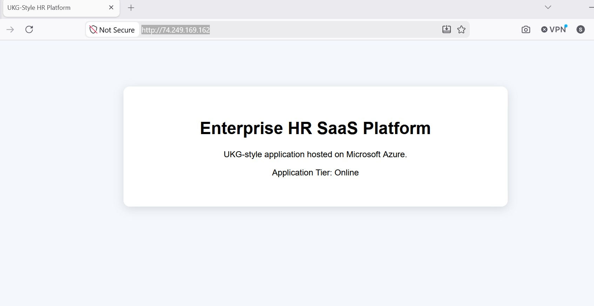

### Network Security Groups

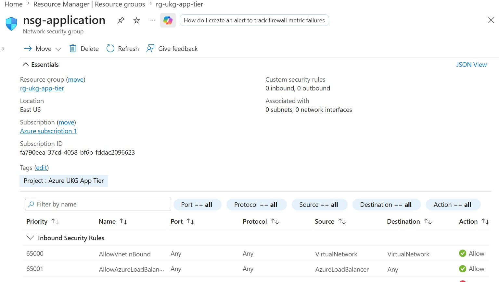

### Azure Overview


### Private Endpoint

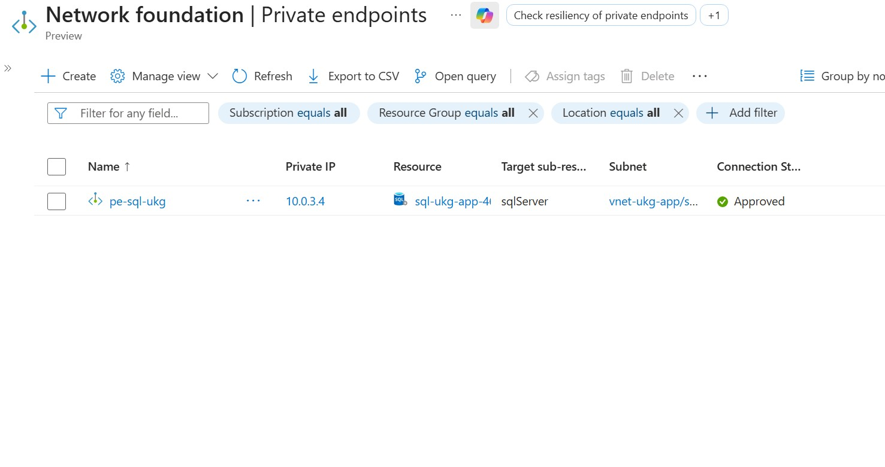

### Resource Groups

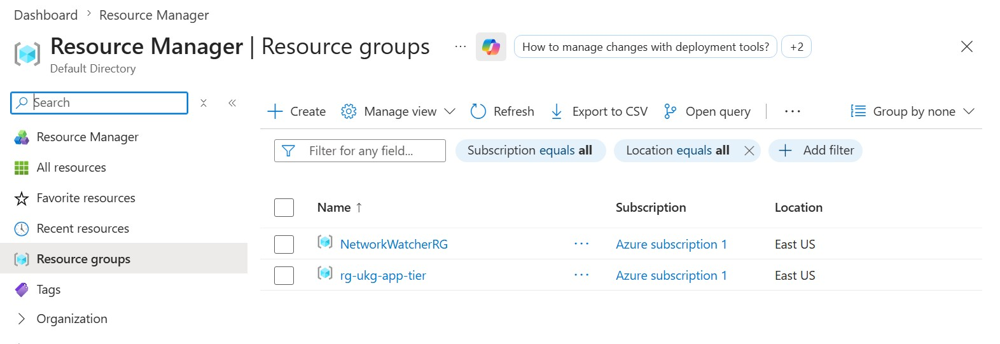

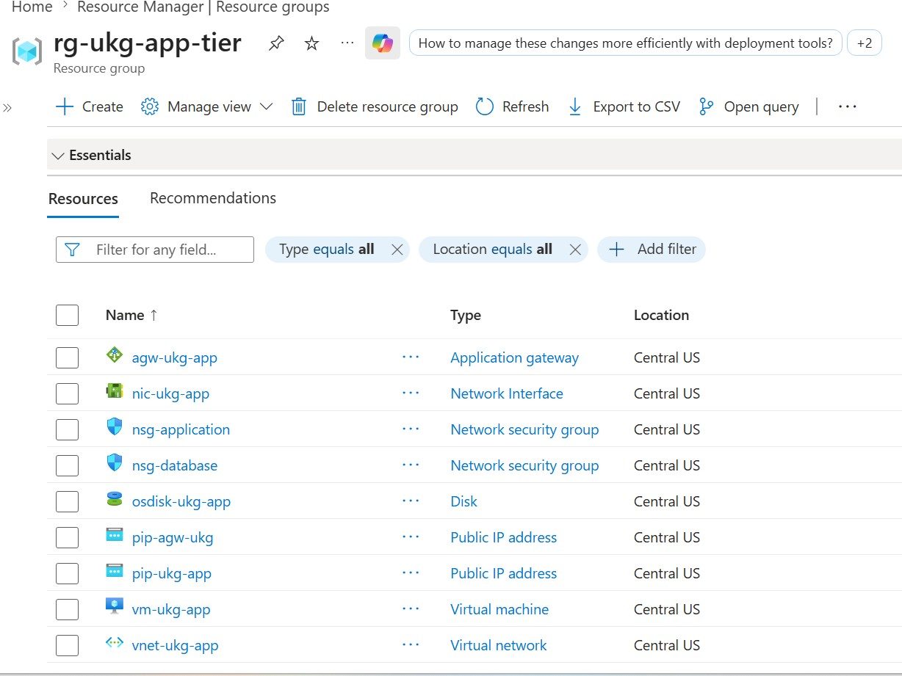

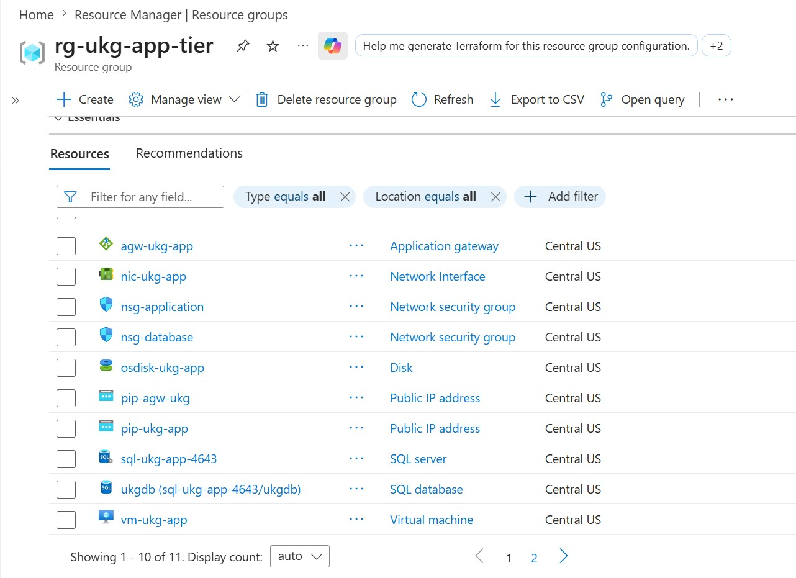

### Azure SQL Database

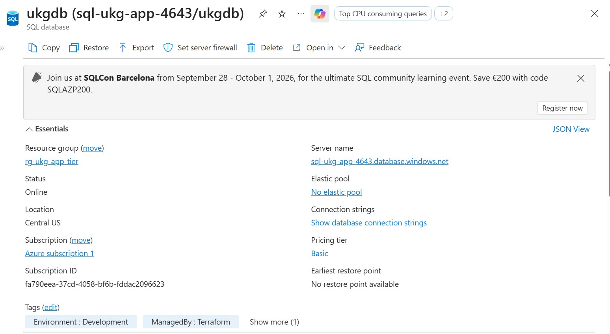

### Azure SQL Server

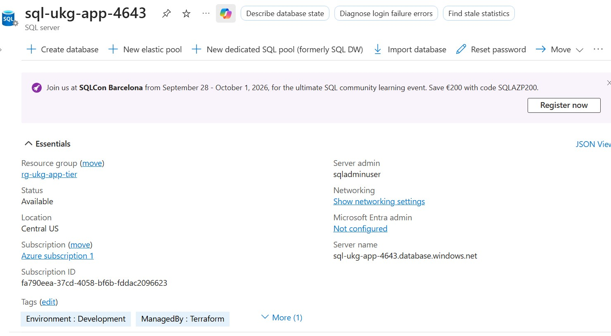

### Virtual Network

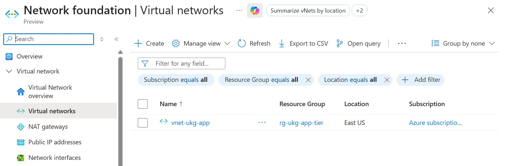
---

## Project Outcome

Successfully designed, provisioned, validated, and managed a production-inspired Azure environment using Terraform. The project demonstrates enterprise cloud engineering concepts including Infrastructure as Code, secure networking, application delivery, Linux administration, Azure SQL, and cloud infrastructure lifecycle management.
